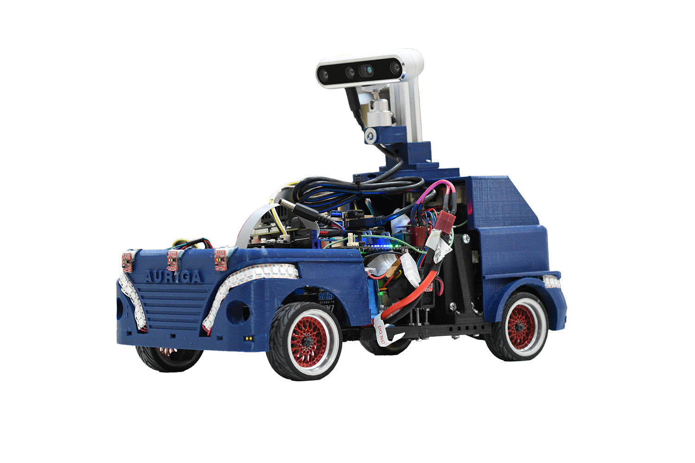

# Auriga Autonomous Vehicle

An autonomous vehicle developed by **Team Auriga** for robotics competitions and autonomous navigation applications.



## Overview

**Auriga** is an autonomous vehicle developed by Team Auriga, integrating perception, localization, planning, and control systems to achieve autonomous navigation and motion control.

The project was developed as a team effort, with different members contributing to the mechanical, electrical, software, perception, and control subsystems.

## My Contribution

As a member of the **Control Team**, my primary responsibility was the development and implementation of the vehicle's control algorithms.

My main contributions include:

* Implementation of a **closed-loop PID controller for speed control**
* Wheel speed estimation using **encoder feedback**
* Implementation of the **Stanley controller for autonomous path tracking**
* Integration of the control algorithms with the vehicle's motor and steering systems
* Controller parameter tuning and performance testing

### Control Architecture

The control system uses encoder feedback to regulate the vehicle's speed and combines path-tracking and steering control algorithms for autonomous navigation.

```text
                 Desired Speed
                      │
                      ▼
                ┌───────────┐
                │ PID Speed │
                │ Controller│
                └─────┬─────┘
                      │
                      ▼
                Motor Control
                      │
                      ▼
                   Vehicle
                      │
                      │
               Encoder Feedback
                      │
                      │
                      ▼
              Speed Measurement
```

For steering control, the **Stanley controller** calculates the desired steering angle based on the vehicle's path and current state.

```text
        Reference Path
              │
              ▼
      ┌───────────────┐
      │    Stanley    │
      │   Controller  │
      └───────┬───────┘
              │
       Desired Steering
            Angle
              │
              ▼
         Servo Motor
              │
              ▼
        Vehicle Steering
```

## Technologies

* C/C++
* PID Control
* Stanley Controller
* Encoder Feedback
* Closed-loop Control
* Autonomous Navigation
* Embedded Systems
* Motor Control

## Team Project

Auriga was developed collaboratively by **Team Auriga**.

The overall system includes multiple subsystems, including:

* Perception
* Localization
* Navigation
* Motion Planning
* Control
* Embedded Systems
* Electrical and Mechanical Systems

My work was primarily focused on the **Control subsystem**, particularly speed and steering control.

## Project Structure

```text
Auriga-Autonomous-Vehicle/
├── README.md
├── images/
│   └── AurigaRobot.png
├── ESP_Control
└── ESP32_Support
```


## Author

**Amirhossein Gholizadeh Behbahani**

Control Team — **Team Auriga**

## Acknowledgment

This project was developed as a collaborative effort by **Team Auriga**.
